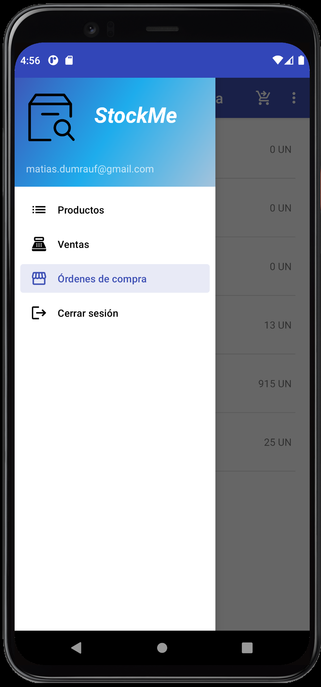

  
  

# StockMe

## Descripción corta
Administración de stock simplificado.

## Descripción larga
StockMe es una solución que permite a un negocio administrar el stock de su catálogo de productos de manera sencilla, generando órdenes de compra, órdenes de venta y el ingreso o egreso de stock.

## Características generales
-	Acceso para múltiples usuarios
-	Alta y modificación de productos
-	Búsqueda de productos mediante código de barras
-	Carga de imagen del producto desde la cámara del dispositivo
-	Alerta de stock mínimo definido por producto
-	Generación de órdenes de compra y órdenes de venta
-	Búsqueda de órdenes mediante código QR

## Capturas de pantalla

   | 
  
  
  
  
  
  
  
  
  
  
  
  
  
  
  
  
  
  
  

## License
[MIT](https://choosealicense.com/licenses/mit/)
